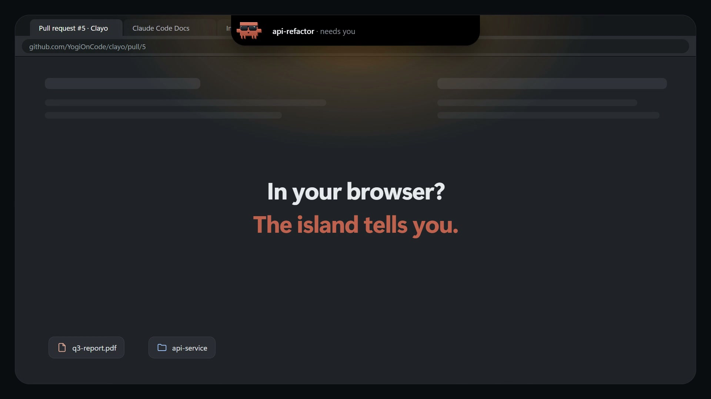
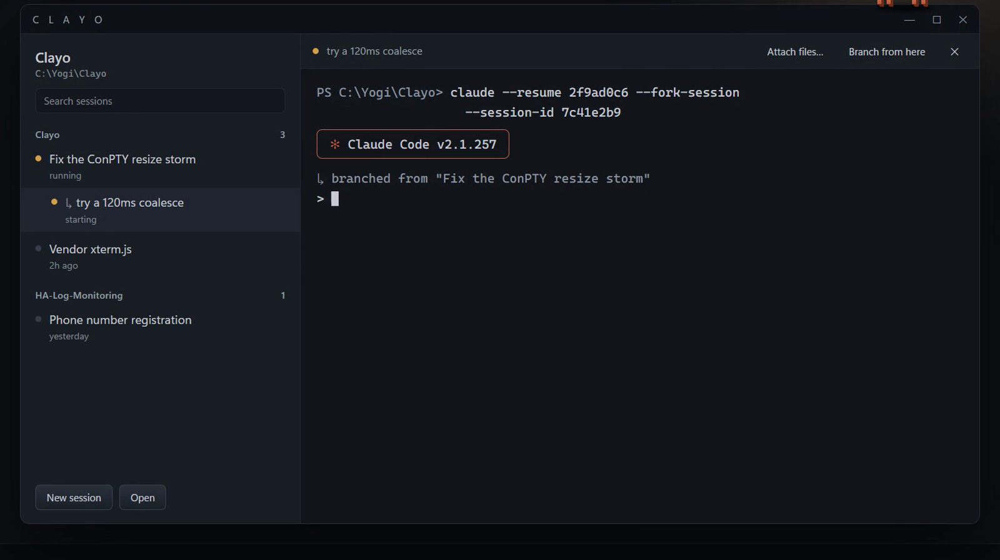
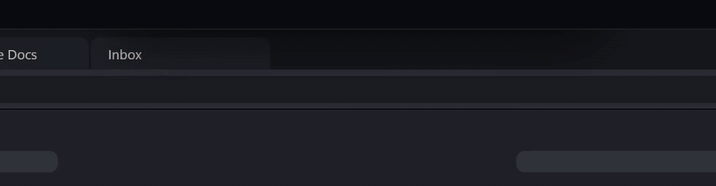

<div align="center">


# Clayo

**Every Claude Code session in one Windows window, plus an island that tells you which one needs you.**


</div>

<!-- Video: drag brag.mp4 into a GitHub comment box, paste the
     https://github.com/user-attachments/assets/… URL on its own line here, and it plays inline. -->

<p align="center"></p>

## Why

You run four or five Claude Code sessions at once, each in its own terminal. One is waiting
for a permission, one finished ten minutes ago, and you're in the browser. Clayo puts them
all in one window and tells you when one needs you, without you switching windows.

## What you get



- **The real Claude Code.** Each pane is a real terminal (ConPTY + xterm.js) running the
  `claude` you already use: slash commands, permission prompts, plan mode, your status line.
- **Sessions on the left, grouped by folder.** Search, rename (F2), resume with a click.
- **Branch from here.** Fork a conversation into a new session. The branch sits under its
  parent; the original stays as it was.
- **The island.** A small pill drops from the top of the screen when a session needs you or
  has finished, even while you're in another app. It never takes focus. Click it to jump to
  that session.

  

- **Drop a file or folder on the island** and it opens in Clayo.
- **Status at a glance.** Each pane's header shows model, branch and diff, context and
  effort. The sidebar footer shows your 5-hour and 7-day limits, drawn as Numbers, Bars,
  Rings or Chips, and the island warns you once when you get near one.
- **Type `clayo` in any Explorer address bar** to open a session in that folder.
- **Stays out of the way.** Start at login, hidden until the island has something to say.
  Closing the window keeps sessions running.

## Install

You need Windows 10 or 11, the [.NET 8 SDK](https://dotnet.microsoft.com/download/dotnet/8.0),
the [WebView2 runtime](https://developer.microsoft.com/microsoft-edge/webview2/) (already on
Windows 11) and [Claude Code](https://docs.claude.com/en/docs/claude-code) on your `PATH`.

```powershell
git clone https://github.com/YogiOnCode/Clayo.git
cd Clayo
dotnet publish src/Clayo -c Release -r win-x64 --self-contained false -o $env:USERPROFILE\.local\clayo
```

Add that folder to your user `PATH`:

```powershell
$p = [Environment]::GetEnvironmentVariable('PATH', 'User')
[Environment]::SetEnvironmentVariable('PATH', "$p;$env:USERPROFILE\.local\clayo", 'User')
```

Don't use `setx` for this: it cuts `PATH` off at 1024 characters. Keep the `Assets\` folder
next to `clayo.exe`; the terminal pane loads from it.

Now type `clayo` in any folder's Explorer address bar, or run it from a terminal.

## Use

- **New session**: the button at the bottom of the sidebar, or `clayo` in a folder.
- **Branch**: open a session, then **Branch from here** in its header.
- **Settings**: the gear menu, or `Ctrl+,`.
- **Quit**: **Quit Clayo** in the gear menu or the island's menu. The window's close button
  only hides it.

More in the [wiki](https://github.com/YogiOnCode/Clayo/wiki). The self-checks in `checks/`
need the .NET 10 SDK (they're file-based apps); the app itself builds with .NET 8.

## Docs

| | |
|---|---|
| [Install](https://github.com/YogiOnCode/Clayo/wiki/Install) | Publish, PATH, updating, uninstalling |
| [Sessions and Branching](https://github.com/YogiOnCode/Clayo/wiki/Sessions-and-Branching) | What each button runs |
| [The Island](https://github.com/YogiOnCode/Clayo/wiki/The-Island) | Notices, peek, drop to open |
| [Status Bar and Limits](https://github.com/YogiOnCode/Clayo/wiki/Status-Bar-and-Limits) | Pane header, limits, themes |
| [Settings](https://github.com/YogiOnCode/Clayo/wiki/Settings) | Every option |
| [Troubleshooting](https://github.com/YogiOnCode/Clayo/wiki/Troubleshooting) | When something looks wrong |
| [How It Works](https://github.com/YogiOnCode/Clayo/wiki/How-It-Works) | The code, module by module |
| [Roadmap](https://github.com/YogiOnCode/Clayo/wiki/Roadmap) | Codex support, setup window, release builds |

## Contributing

Issues and pull requests are welcome. Open an issue before a big change so we can agree on
the approach first. Pull requests to `main` need one review and are squash-merged. See
[Contributing](https://github.com/YogiOnCode/Clayo/wiki/Contributing) for building and
running the checks. Found a security issue? Report it privately from the **Security** tab,
not in an issue.

## Notes

Not affiliated with Anthropic. Clayo reads `~/.claude` and never writes to it. Where it does
keep files is listed in [How It Works](https://github.com/YogiOnCode/Clayo/wiki/How-It-Works#where-clayo-keeps-its-files).

MIT licensed, see [LICENSE](LICENSE). Bundles [xterm.js](https://github.com/xtermjs/xterm.js)
and its fit and WebGL addons (MIT, see `src/Clayo/Assets/xterm/LICENSE.xterm`).
